# Cortex.io IDP Implementation - Critical Path Workflow

> A phased approach from foundation setup through proof of value to production pilot deployment

---

## Executive Summary

This document outlines the critical path for implementing Cortex.io Internal Developer Platform (IDP). The implementation follows three distinct phases, each with clear prerequisites and deliverables.

```mermaid
flowchart LR
    subgraph P0[" Phase 0: Prerequisites "]
        Z[Contract] --> A[Axion Relay ✓]
        A --> B[Network Setup]
        B --> C[Cortex.io App]
        C --> D[Kratix + Harness ✓]
        D --> E[AKS + Promises ✓]
        E --> F[Coder CDE]
        F --> G[Data Ingestion]
    end

    subgraph P1[" Phase 1: PoV Workshop "]
        H[Test Scenarios] --> I[Demo App]
        I --> J[Deliverables]
    end

    subgraph P2[" Phase 2: Pilot "]
        K[Real Java App] --> L[EKS Deployment]
        L --> M[Kratix Promises]
    end

    P0 -->|Gateway| P1
    P1 -->|Validated| P2

    style P0 fill:#1e293b,stroke:#64748b,stroke-width:2px
    style P1 fill:#1e3a5f,stroke:#3b82f6,stroke-width:2px
    style P2 fill:#1a3d2e,stroke:#10b981,stroke-width:2px
```



---

## Phase 0: Prerequisites (Foundation)

> All prerequisites must be completed before PoV Workshop can commence

### Contract

| Task | Description | Status |
|------|-------------|--------|
| **VEQ** | Vendor Evaluation Questionnaire | ✅ Complete |
| **SaaS Review** | SaaS security and compliance review | ⬜ Pending |
| **AI Review** | AI/ML capabilities and usage review | ⬜ Pending |
| **Purchase Request** | Procurement and purchase request submission | ✅ Complete |
| **MSA** | Master Service Agreement negotiation | ⬜ Pending |
| **Contract Executed** | Final contract signature and execution | ⬜ Pending |

### Infrastructure Setup

| Task | Description | Status |
|------|-------------|--------|
| **Install Axion Relay** | Deploy Cortex Axion Relay for secure data transmission | ✅ Complete |
| **Network/Connectivity Setup** | Configure network paths and firewall rules for Cortex connectivity | ⬜ Pending |
| **Install Cortex.io App** | Deploy and configure the Cortex.io application | ⬜ Pending |

### Platform Orchestration

| Component | Description | Status |
|-----------|-------------|--------|
| **Kratix Integration with Harness** | Platform Orchestrator integrated with Harness CD pipeline | ✅ Complete |
| **AKS Cluster Deployment** | Azure Kubernetes Service - deployment target for PoV | ✅ Complete |
| **Kratix Promise — Known Namespace** | Promise instrumented for known namespace deployments on AKS | ✅ Complete |
| **Kratix Promise — Unknown Namespace** | Promise instrumented for dynamic/unknown namespace deployments on AKS | ✅ Complete |

### Development Environment

| Component | Description | Status |
|-----------|-------------|--------|
| **Coder — Cloud Dev Environment** | Cloud-based development environment for developers | ⬜ Pending |
| **Coder + Cortex.io Integration** | Connect Coder to Cortex.io for visibility and catalog integration | ⬜ Pending |
| **CI Build Tools & Dependencies** | All build tools/dependencies installed to execute CI build pipeline | ⬜ Pending |

### Data Ingestion - CI/CD/CV Pipeline Tools


| Tool | Purpose | Integration Type | Status |
|------|---------|------------------|--------|
| **GitHub** | Source Control | API Integration | ⬜ Pending |
| **GitLab** | Source Control | API Integration | ⬜ Pending |
| **Nexus** | Artifact Repository | API Integration | ⬜ Pending |
| **Fortify** | Security Scanning (SAST) | API Integration | ⬜ Pending |
| **Sonatype** | Dependency Analysis (SCA) | API Integration | ⬜ Pending |
| **Harness** | CI/CD Pipeline | API Integration | ⬜ Pending |
| **SonarQube** | Code Quality Analysis | API Integration | ⬜ Pending |
| **Dynatrace** | Application Performance Monitoring | API Integration | ⬜ Pending |
| **Splunk** | Log Management & Analytics | API Integration | ⬜ Pending |
| **ServiceNow** | IT Service Management | API Integration | ⬜ Pending |
| **KatanaDB** | Database Management | API Integration | ⬜ Pending |

### Prerequisites Checklist

**Infrastructure Setup:**
- [x] Axion Relay installed and operational
- [ ] Network connectivity verified
- [ ] Cortex.io App installed and configured

**Platform Orchestration:**
- [x] Kratix integration with Harness configured
- [x] AKS Cluster deployed and accessible
- [x] Kratix Promise — Known Namespace instrumented
- [x] Kratix Promise — Unknown Namespace instrumented

**Development Environment:**
- [ ] Coder cloud dev environment deployed
- [ ] Coder integrated with Cortex.io
- [ ] CI build tools and dependencies configured

**Data Ingestion - CI/CD Tools:**
- [ ] GitHub integration configured
- [ ] GitLab integration configured
- [ ] Nexus integration configured
- [ ] Fortify integration configured
- [ ] Sonatype integration configured
- [ ] Harness integration configured
- [ ] SonarQube integration configured
- [ ] Data ingestion validated for all tools

---

## Phase 1: Proof of Value (PoV) Workshop

> Demonstrate full end-to-end connectivity and value delivery

### Architecture Overview


> **Note:** Platform Orchestration (Kratix + AKS) is configured in Phase 0 Prerequisites

### Test Scenarios

| Scenario | Description | Purpose | Status |
|----------|-------------|---------|--------|
| **Java/SpringBoot Demo App** | Simulated application for end-to-end testing | Validate deployment pipeline | ⬜ Pending |
| **One-Touch Assembly & Launch Control** | Platform engineering workflow for service onboarding | Validate data mappings through scoring | ⬜ Pending |
| **Greenfield** | New application deployment from scratch | Validate new project onboarding | ⬜ Pending |
| **Brownfield** | Existing application migration/integration | Validate legacy system support | ⬜ Pending |

---

#### One-Touch Assembly & Launch Control (Platform Engineer Perspective)

> **Platform Engineer User Story:**
> "As a **Platform Engineer**, I want to construct One-Touch Assembly and Launch Control & Verify workflows, so that we can create our first entries into the service catalog and validate our data mappings workflow through scoring."

**One-Touch Assembly:**
Automated service onboarding that creates a fully configured service catalog entry with a single action.

1. **Service Registration** — Automatically populate service catalog entry from repository metadata
2. **Ownership Assignment** — Map service to team, domain, and responsible owners
3. **Integration Wiring** — Connect all CI/CD tool integrations (GitHub/GitLab, Harness, Fortify, Sonatype, SonarQube)
4. **Scorecard Association** — Attach relevant scorecards for production readiness evaluation

**Launch Control & Verify:**
Validation workflow ensuring data flows correctly from source tools through to scoring.

1. **Data Mapping Validation** — Verify all integration data points map correctly to Cortex entities
2. **Scorecard Execution** — Trigger scorecard evaluation and confirm rules execute against live data
3. **Score Verification** — Validate scoring output matches expected results based on source tool data
4. **End-to-End Traceability** — Confirm data lineage from source tool → Cortex → Scorecard → Score

**Acceptance Criteria:**
- [ ] One-Touch Assembly workflow successfully creates service catalog entry
- [ ] All integration data points populate correctly in service entity
- [ ] Launch Control executes scorecard evaluation without errors
- [ ] Verify workflow confirms data mappings are accurate
- [ ] Service achieves expected Bronze level score based on current CI/CD state
- [ ] Workflow is repeatable and documented for future service onboarding

---

#### Greenfield Test Scenario (Developer Perspective)

> **What You're Testing:** Deploying a brand new Java/SpringBoot application from scratch — like starting a fresh project with no existing infrastructure.

**As a Developer, You Will:**

1. Create a new service catalog entry in Cortex.io for your application
2. Configure your repository (GitHub/GitLab) with the standard CI/CD pipeline templates
3. Submit a deployment request through Kratix — the platform will automatically provision your namespace on AKS
4. Watch Harness pick up your deployment and push your SpringBoot app to the cluster
5. Verify your app appears in Cortex with proper scorecards showing build status, security scans (Fortify/Sonatype), and code quality (SonarQube)
6. Confirm the Leadership Dashboard reflects your new service in the portfolio view

**Success Looks Like:** Your new app is running on AKS, fully visible in Cortex.io with all integrations working — scorecards populate automatically, engineering insights show your DORA metrics, and leadership can see the new service in their dashboards. Zero manual configuration required beyond your initial request.

---

#### Brownfield Test Scenario (Developer Perspective)

> **What You're Testing:** Onboarding an existing Java/SpringBoot application that's already running — like migrating a legacy app or bringing an existing service under platform management.

**As a Developer, You Will:**

1. Register your existing application in Cortex.io — point it to your current repository and existing deployment
2. Connect your existing CI/CD pipelines (already in Harness) to the Kratix workflow
3. Map your current namespace to Kratix's known namespace promise — no disruption to running services
4. Backfill historical data by ensuring all integrations (Fortify scans, Sonatype reports, SonarQube analysis) flow into Cortex
5. Validate that your existing app's metrics and health data appear correctly in scorecards
6. Verify engineering insights capture your deployment history and incident patterns

**Success Looks Like:** Your existing app continues running without downtime while now being fully managed by the platform. Cortex.io shows accurate data from your historical CI/CD runs, security scans populate from past Fortify/Sonatype results, and your team can finally see a unified view of all their services — both old and new — in one place.

---

### Demo Application

| Attribute | Value |
|-----------|-------|
| **Type** | Simulated Application |
| **Stack** | Java / SpringBoot |
| **Target** | AKS Container Cluster |
| **Purpose** | End-to-end workflow validation |

### Deliverables


| Deliverable | Description | Audience | Status |
|-------------|-------------|----------|--------|
| **Scorecards** | Service health and compliance metrics | Engineering Teams | ⬜ Pending |
| **Engineering Intelligence** | Technical debt, code quality, deployment frequency, custom queries | Engineering Leadership | ⬜ Pending |
| **Leadership Dashboards** | Portfolio-level visibility and trends | Executive Leadership | ⬜ Pending |

---

#### Scorecards Deliverable (User Stories)

> **Developer User Story:**
> "As a **Developer**, I want to know that my code commit passed through and scored with the production readiness pipeline, so that I have confidence my changes meet our organization's quality and security standards before deployment."

**Scorecards to Validate:**
1. **Production Readiness** — Validates the service meets deployment criteria including documentation, ownership, and operational requirements
2. **Onboarding Scorecard** — Ensures new services complete all required onboarding steps and configurations
3. **Security Standards** — Confirms Fortify SAST scans pass, Sonatype dependency checks clear, and security policies are met
4. **Service Maturity** — Measures the overall maturity of the service across observability, reliability, and documentation
5. **Velocity Scorecard** — Tracks DORA metrics including deployment frequency, lead time, and change failure rate

> **Platform Engineer User Story:**
> "As a **Platform Engineer**, I want to construct a custom Production Readiness scorecard via CQL (Cortex Query Language) that the PoV successfully scores as **Bronze level**, so that we can emulate our current state of capabilities in our CI/CD/CV pipelines and establish a baseline for improvement."

**Acceptance Criteria:**
- [ ] Demo app appears in Cortex.io service catalog
- [ ] All five scorecards display accurate, real-time data from integrated tools
- [ ] Custom CQL-based Production Readiness scorecard is created and functional
- [ ] Demo app achieves Bronze level on the custom scorecard
- [ ] Scorecard results reflect actual CI/CD pipeline execution data

🔗 **Reference:** [Cortex.io Scorecards Dashboard](https://app.demo.cortex.io/admin/scorecards)

---

#### Engineering Intelligence Deliverable (User Stories)

> **Engineering Manager User Story:**
> "As an **Engineering Manager**, I want to see aggregated intelligence across my team's services, so that I can identify technical debt, track improvement trends, and make data-driven decisions about where to invest engineering effort."

**Intelligence to Validate:**
1. **DORA Metrics** — Deployment frequency, lead time for changes, change failure rate, and mean time to restore via Harness integration
2. **Scorecard Trends** — Track scorecard level progression (Bronze/Silver/Gold) across services and teams over time
3. **Service Catalog Analytics** — Visibility into service ownership, team coverage, and catalog completeness
4. **Initiative Progress** — Track organizational initiatives and goals across the service portfolio
5. **Team & Domain Insights** — Aggregated views of engineering health by team, domain, or business unit
6. **Custom Dashboards** — Ability to create and configure custom dashboard views for specific use cases

**Acceptance Criteria:**
- [ ] Engineering Intelligence Dashboard displays data from demo app deployment
- [ ] DORA metrics reflect actual Harness deployment pipeline data
- [ ] Scorecard trends show progression over the PoV period
- [ ] Service catalog accurately reflects demo app metadata and ownership
- [ ] Team/domain aggregations correctly group services
- [ ] Custom dashboard views can be created and saved

🔗 **Reference:** [Cortex.io Engineering Intelligence Dashboards](https://app.demo.cortex.io/admin/eng-intelligence/dashboards)

---

#### Leadership Dashboards Deliverable (User Stories)

> **Executive User Story:**
> "As an **Engineering Director**, I want a portfolio-level view of all services and their production readiness status, so that I can understand organizational risk, track compliance across teams, and report on engineering health to leadership."

**Executive Reports to Validate:**
1. **Portfolio Overview** — High-level view of all services with scorecard status (Bronze/Silver/Gold) distribution
2. **Risk & Compliance** — Services failing security standards, overdue reviews, or missing critical metadata
3. **Team Performance** — Comparative view of scorecard achievements across different teams/domains
4. **Trend Analysis** — Historical view showing improvement or regression in production readiness over time
5. **Initiative Tracking** — Progress toward organizational goals and compliance targets

**Initiatives to Configure & Track:**
1. **Marshall Plan** — Track services with code quality coverage <80% and drive improvement toward compliance threshold
2. **AppSec SCM Policy Compliance** — Monitor Enterprise Git (GitHub/GitLab) security policy adherence across all repositories

> **Platform Engineer User Story:**
> "As a **Platform Engineer**, I want to configure executive reports and initiative tracking that surface the right level of detail for leadership, so that they can make informed decisions and track progress toward organizational goals."

**Acceptance Criteria:**
- [ ] Executive Reports dashboard shows demo app in portfolio view
- [ ] Scorecard level (Bronze) is visible at portfolio level
- [ ] Dashboard correctly categorizes service by team/domain
- [ ] Drill-down capability from portfolio to individual service works
- [ ] Marshall Plan initiative configured and tracking code quality <80%
- [ ] AppSec SCM Policy initiative configured for GitHub/GitLab compliance
- [ ] Initiative progress accurately reflects demo app compliance status

🔗 **Reference:** [Cortex.io Executive Reports](https://app.demo.cortex.io/admin/reports/executive)

### PoV Success Criteria

- [ ] Greenfield scenario validated
- [ ] Brownfield scenario validated
- [ ] Java/SpringBoot demo app deploys successfully to AKS
- [ ] Scorecards accurately reflect service state
- [ ] Engineering Insights populated with meaningful data
- [ ] Leadership Dashboards display portfolio metrics
- [ ] End-to-end workflow demonstrated to stakeholders

---

## Phase 2: Production Pilot

> Real application deployment with full integration validation

### Architecture Evolution

```mermaid
flowchart TB
    subgraph Phase 1 - PoV
        direction TB
        P1_APP[Simulated Java App]
        P1_KR[Kratix]
        P1_AKS[AKS Cluster]
        P1_APP --> P1_KR --> P1_AKS
    end

    subgraph Phase 2 - Pilot
        direction TB
        P2_APP[Real Java App]
        P2_KR[Kratix + New Promises]
        P2_EKS[EKS Cluster]
        P2_APP --> P2_KR --> P2_EKS
    end

    Phase 1 - PoV ==>|Evolution| Phase 2 - Pilot

    style P1_AKS fill:#3b82f6,stroke:#60a5fa
    style P2_EKS fill:#10b981,stroke:#34d399
```

### Production Deployment

| Component | Phase 1 (PoV) | Phase 2 (Pilot) |
|-----------|---------------|-----------------|
| **Application** | Simulated Java/SpringBoot | Real Java Application |
| **Target Cluster** | AKS (Azure) | EKS (AWS) |
| **Kratix Promises** | Basic deployment | Extended for EKS pathway |

### Integration Requirements

| Requirement | Description | Status |
|-------------|-------------|--------|
| **Complete All Integrations** | Ensure all CI/CD tool integrations are production-ready | ⬜ Pending |
| **Kratix Promises for EKS** | Create new Kratix promises for AWS EKS deployment pathway | ⬜ Pending |
| **Cross-Cloud Validation** | Verify Cortex visibility across Azure and AWS deployments | ⬜ Pending |

### Kratix Promise Requirements


### Pilot Success Criteria

- [ ] All Phase 0 integrations validated in production
- [ ] Kratix EKS promises constructed and tested
- [ ] Real Java application deploys successfully to EKS
- [ ] Scorecards reflect production application state
- [ ] Engineering Insights show real metrics
- [ ] Leadership Dashboards demonstrate cross-cloud visibility
- [ ] End-to-end workflow validated

---

## Critical Path Dependencies


---

## Risk Assessment

> Proactive identification and mitigation of implementation risks

### Risk Matrix Overview


### Risk Categories


---

### Phase 0 Risks (Prerequisites)

| ID | Risk | Likelihood | Impact | Description |
|----|------|------------|--------|-------------|
| **R0.1** | Network Connectivity Blocked | High | Critical | Corporate firewall rules or security policies prevent Axion Relay from establishing outbound connections to Cortex.io |
| **R0.2** | Integration API Limitations | Medium | High | One or more CI/CD tools (GitHub, GitLab, Nexus, Fortify, Sonatype, Harness, SonarQube) have API restrictions, rate limits, or missing permissions |
| **R0.3** | Axion Relay Deployment Failure | Medium | Critical | Infrastructure constraints prevent successful Axion Relay installation (container runtime issues, resource limits, permissions) |
| **R0.4** | Data Ingestion Gaps | Medium | Medium | Incomplete or inconsistent data from source tools leads to inaccurate Cortex representation |
| **R0.5** | Environment Access Delays | Medium | High | Delays in obtaining necessary credentials, tokens, or access rights for tool integrations |

#### Phase 0 Mitigation Strategies

| Risk ID | Mitigation Strategy | Owner |
|---------|---------------------|-------|
| R0.1 | Engage InfoSec early; document required endpoints and ports; request firewall exceptions in advance | Platform Team |
| R0.2 | Audit API capabilities for each tool pre-implementation; identify fallback data sources; engage vendor support | Integration Lead |
| R0.3 | Validate infrastructure requirements; conduct pre-flight checks; have rollback plan ready | DevOps Team |
| R0.4 | Define data quality acceptance criteria; implement validation checks; establish data reconciliation process | Data Team |
| R0.5 | Create access request checklist; submit requests early; identify backup approvers | Project Manager |

---

### Phase 1 Risks (PoV Workshop)

| ID | Risk | Likelihood | Impact | Description |
|----|------|------------|--------|-------------|
| **R1.1** | Kratix Integration Complexity | Medium | High | Kratix platform orchestration proves more complex than anticipated; promises don't behave as expected |
| **R1.2** | AKS Cluster Issues | Low | High | AKS cluster unavailable, misconfigured, or lacks required permissions for demo deployment |
| **R1.3** | Demo App Deployment Failure | Medium | Medium | Java/SpringBoot simulated application fails to deploy or doesn't generate expected telemetry |
| **R1.4** | Scorecard Data Mismatch | Medium | High | Scorecards, insights, or dashboards don't accurately reflect the deployed application state |
| **R1.5** | Stakeholder Availability | Medium | Medium | Key stakeholders unavailable for PoV workshop, delaying validation and decisions |
| **R1.6** | Greenfield/Brownfield Gap | Medium | Medium | Significant differences in behavior between greenfield and brownfield scenarios reveal limitations |

#### Phase 1 Mitigation Strategies

| Risk ID | Mitigation Strategy | Owner |
|---------|---------------------|-------|
| R1.1 | Conduct Kratix spike/POC before workshop; engage Kratix community/support; document promise patterns | Platform Team |
| R1.2 | Verify AKS cluster health pre-workshop; have backup cluster available; test RBAC permissions | Cloud Team |
| R1.3 | Pre-build and test demo app independently; have multiple demo scenarios ready; prepare manual fallback | Dev Team |
| R1.4 | Define expected data mappings upfront; validate data pipeline end-to-end before workshop; have debug tools ready | Integration Lead |
| R1.5 | Schedule stakeholders early; record sessions; prepare async review materials | Project Manager |
| R1.6 | Document known limitations; set realistic expectations; identify workarounds | Solution Architect |

---

### Phase 2 Risks (Pilot)

| ID | Risk | Likelihood | Impact | Description |
|----|------|------------|--------|-------------|
| **R2.1** | EKS Configuration Complexity | High | High | AWS EKS setup requires different configuration patterns than AKS; cross-cloud networking challenges |
| **R2.2** | Kratix Promise Gaps | Medium | Critical | Existing Kratix promises don't translate to EKS; significant rework required for new pathway |
| **R2.3** | Real App Dependencies | Medium | High | Production Java application has dependencies or configurations not present in simulated PoV app |
| **R2.4** | Cross-Cloud Visibility | Medium | High | Cortex struggles to provide unified visibility across Azure (AKS) and AWS (EKS) deployments |
| **R2.5** | Production Data Sensitivity | Medium | Medium | Real application data triggers security/compliance concerns for Cortex ingestion |
| **R2.6** | Integration Drift | Low | Medium | CI/CD tool configurations change between PoV and Pilot, breaking established integrations |

#### Phase 2 Mitigation Strategies

| Risk ID | Mitigation Strategy | Owner |
|---------|---------------------|-------|
| R2.1 | Engage AWS expertise; document EKS-specific requirements; test connectivity early | Cloud Team |
| R2.2 | Design promises with portability in mind from Phase 1; abstract cloud-specific details; plan promise refactoring | Platform Team |
| R2.3 | Analyze real app requirements during Phase 1; identify gaps early; plan dependency resolution | Dev Team |
| R2.4 | Validate multi-cloud support with Cortex; design unified tagging/labeling strategy | Solution Architect |
| R2.5 | Engage security team early; define data classification; implement data filtering if needed | Security Team |
| R2.6 | Implement configuration-as-code; version control integrations; establish change management process | DevOps Team |

---

### Cross-Phase Risks

| ID | Risk | Likelihood | Impact | Description |
|----|------|------------|--------|-------------|
| **RX.1** | Resource Contention | Medium | High | Key personnel pulled to other priorities; insufficient dedicated time for implementation |
| **RX.2** | Scope Creep | Medium | Medium | Additional requirements emerge mid-implementation; "while we're at it" syndrome |
| **RX.3** | Knowledge Silos | Medium | High | Critical knowledge concentrated in single individuals; no backup expertise |
| **RX.4** | Vendor Responsiveness | Low | Medium | Cortex.io or tool vendors slow to respond to support requests or issues |
| **RX.5** | Timeline Compression | Medium | High | External pressures force acceleration of phases without completing prerequisites |

#### Cross-Phase Mitigation Strategies

| Risk ID | Mitigation Strategy | Owner |
|---------|---------------------|-------|
| RX.1 | Secure dedicated resource commitments; establish clear escalation path; identify backup resources | Project Manager |
| RX.2 | Define clear scope boundaries; implement change control process; defer non-critical items to backlog | Project Manager |
| RX.3 | Document all configurations and decisions; conduct knowledge sharing sessions; pair team members | Team Lead |
| RX.4 | Establish vendor contacts early; document SLAs; have internal workarounds identified | Integration Lead |
| RX.5 | Communicate phase dependencies clearly; document risks of skipping steps; get stakeholder sign-off on go/no-go criteria | Project Manager |

---

### Risk Response Summary


### Risk Register Summary

| Priority | Count | Top Risks |
|----------|-------|-----------|
| **Critical** | 3 | R0.1 (Network), R0.3 (Axion Relay), R2.2 (Kratix Promises) |
| **High** | 8 | R0.2, R0.5, R1.1, R1.4, R2.1, R2.3, R2.4, RX.1, RX.5 |
| **Medium** | 7 | R0.4, R1.3, R1.5, R1.6, R2.5, RX.2, RX.3 |
| **Low** | 2 | R1.2, R2.6, RX.4 |

### Recommended Actions Before Kickoff

- [ ] Schedule InfoSec meeting to review network requirements (R0.1)
- [ ] Audit all 7 CI/CD tool APIs for integration readiness (R0.2)
- [ ] Validate Axion Relay infrastructure requirements (R0.3)
- [ ] Validate Cortex.io App deployment requirements
- [ ] Confirm Kratix and AKS cluster availability
- [ ] Secure dedicated resource commitments in writing (RX.1)
- [ ] Define explicit scope boundaries and change control process (RX.2)
- [ ] Establish go/no-go criteria for each phase gate (RX.5)

---

## Quick Reference

### Phase Summary

| Phase | Focus | Target | Key Outcome |
|-------|-------|--------|-------------|
| **Phase 0** | Foundation | Infrastructure + Platform | All integrations operational, Kratix + AKS ready |
| **Phase 1** | PoV Workshop | Simulated App on AKS | Validated value demonstration |
| **Phase 2** | Pilot | Real App on EKS | Production-ready deployment |

### Tool Stack

| Category | Tools |
|----------|-------|
| **Source Control** | GitHub, GitLab |
| **Artifacts** | Nexus |
| **Security** | Fortify (SAST), Sonatype (SCA) |
| **Code Quality** | SonarQube |
| **CI/CD** | Harness |
| **Orchestration** | Kratix |
| **Development Environment** | Coder (Cloud Dev Environment) |
| **Kubernetes** | AKS (Phase 0/1), EKS (Phase 2) |
| **IDP** | Cortex.io |

---

## Document Information

| Attribute | Value |
|-----------|-------|
| **Project** | Cortex.io IDP Implementation |
| **Document** | Critical Path Workflow |
| **Version** | 1.1 |
| **Last Updated** | January 2026 |
| **Organization** | Fiserv |
