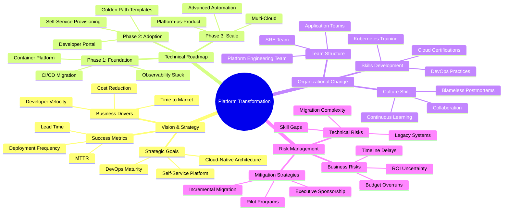
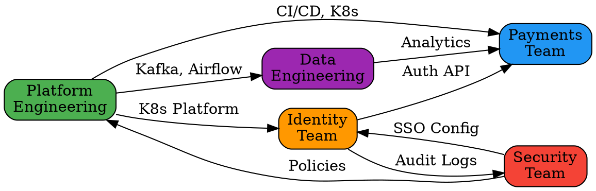

# Skill: Mindmap Generator

## Description
Generate interactive, hierarchical mindmaps for platform engineering concepts, architecture diagrams, transformation roadmaps, stakeholder relationships, dependency mapping, and strategic planning. Supports multiple output formats including Mermaid, D3.js, React Flow, and static SVG/PNG exports.

## Usage
```bash
/mindmap-generator --topic "platform-transformation" --format mermaid --depth 3
/mindmap-generator --topic "stakeholder-ecosystem" --format react-flow --interactive true
/mindmap-generator --topic "technical-architecture" --format d3 --export svg
```

## Parameters

### Required
- `--topic` (string): Subject for mindmap generation
  - `platform-transformation`: Multi-year transformation roadmap
  - `stakeholder-ecosystem`: Stakeholder relationships and influence
  - `technical-architecture`: System architecture and components
  - `capability-model`: Platform capabilities hierarchy
  - `dependency-map`: Cross-team dependencies
  - `risk-landscape`: Risk categories and mitigation
  - `technology-stack`: Tech stack components and relationships
  - `organizational-structure`: Team structure and reporting
  - `value-streams`: Value delivery flows
  - `custom`: User-defined topic with custom nodes

### Optional
- `--format` (string): Output format: "mermaid", "d3", "react-flow", "plantuml", "graphviz" (default: "mermaid")
- `--depth` (number): Hierarchy depth levels: 1-5 (default: 3)
- `--interactive` (boolean): Enable interactive features (zoom, pan, collapse) (default: false)
- `--layout` (string): Layout algorithm: "radial", "tree", "force-directed", "hierarchical" (default: "tree")
- `--export` (string): Export format: "svg", "png", "pdf", "json" (default: none)
- `--theme` (string): Visual theme: "light", "dark", "corporate", "colorful" (default: "light")
- `--collapse-level` (number): Auto-collapse nodes beyond depth (default: none)

---

## Mindmap Templates

### 1. Platform Transformation Mindmap

**Topic**: `platform-transformation`

**Hierarchy**:
```
Platform Transformation
├── Vision & Strategy
│   ├── Business Drivers
│   │   ├── Cost Reduction
│   │   ├── Developer Velocity
│   │   └── Time to Market
│   ├── Strategic Goals
│   │   ├── Self-Service Platform
│   │   ├── Cloud-Native Architecture
│   │   └── DevOps Maturity
│   └── Success Metrics
│       ├── Deployment Frequency
│       ├── Lead Time
│       └── MTTR
├── Technical Roadmap
│   ├── Phase 1: Foundation (Q1-Q2)
│   │   ├── CI/CD Migration
│   │   ├── Container Platform
│   │   └── Observability Stack
│   ├── Phase 2: Adoption (Q3-Q4)
│   │   ├── Developer Portal
│   │   ├── Self-Service Provisioning
│   │   └── Golden Path Templates
│   └── Phase 3: Scale (Year 2)
│       ├── Multi-Cloud
│       ├── Platform-as-Product
│       └── Advanced Automation
├── Organizational Change
│   ├── Team Structure
│   │   ├── Platform Engineering Team
│   │   ├── Application Teams
│   │   └── SRE Team
│   ├── Skills Development
│   │   ├── Kubernetes Training
│   │   ├── Cloud Certifications
│   │   └── DevOps Practices
│   └── Culture Shift
│       ├── Blameless Postmortems
│       ├── Continuous Learning
│       └── Collaboration
└── Risk Management
    ├── Technical Risks
    │   ├── Migration Complexity
    │   ├── Legacy Systems
    │   └── Skill Gaps
    ├── Business Risks
    │   ├── Budget Overruns
    │   ├── Timeline Delays
    │   └── ROI Uncertainty
    └── Mitigation Strategies
        ├── Pilot Programs
        ├── Incremental Migration
        └── Executive Sponsorship
```

**Mermaid Output**:


---

### 2. Stakeholder Ecosystem Mindmap

**Topic**: `stakeholder-ecosystem`

**Hierarchy**:
```
Stakeholder Ecosystem
├── Executive Leadership
│   ├── CTO
│   │   ├── Influence: High
│   │   ├── Interest: High
│   │   └── Strategy: Engage Closely
│   ├── CFO
│   │   ├── Influence: High
│   │   ├── Interest: Medium
│   │   └── Strategy: Keep Satisfied
│   └── CEO
│       ├── Influence: Very High
│       ├── Interest: Medium
│       └── Strategy: Keep Informed
├── Engineering Teams
│   ├── Platform Engineering
│   │   ├── Role: Owners
│   │   ├── Impact: Direct
│   │   └── Engagement: Daily
│   ├── Application Teams
│   │   ├── Role: Customers
│   │   ├── Impact: High
│   │   └── Engagement: Weekly
│   └── SRE Team
│       ├── Role: Partners
│       ├── Impact: High
│       └── Engagement: Daily
├── Business Stakeholders
│   ├── Product Management
│   │   ├── Concern: Time to Market
│   │   ├── Metric: Feature Velocity
│   │   └── Communication: Bi-weekly
│   ├── Operations
│   │   ├── Concern: Stability
│   │   ├── Metric: Uptime
│   │   └── Communication: Weekly
│   └── Sales/Customer Success
│       ├── Concern: Customer Impact
│       ├── Metric: CSAT
│       └── Communication: Monthly
└── External Partners
    ├── Vendors
    │   ├── GitHub
    │   ├── Harness
    │   └── Datadog
    ├── Consultants
    │   ├── Cloud Migration
    │   └── DevOps Advisory
    └── Community
        ├── Open Source Contributors
        └── Industry Peers
```

**React Flow Interactive Node Structure**:
```javascript
const stakeholderNodes = [
  {
    id: 'root',
    type: 'custom',
    data: {
      label: 'Stakeholder Ecosystem',
      influence: 'N/A',
      interest: 'N/A'
    },
    position: { x: 400, y: 50 }
  },
  {
    id: 'exec',
    type: 'group',
    data: { label: 'Executive Leadership' },
    position: { x: 100, y: 150 },
    style: { backgroundColor: '#e3f2fd', width: 300, height: 250 }
  },
  {
    id: 'cto',
    type: 'stakeholder',
    data: {
      label: 'CTO',
      influence: 'High',
      interest: 'High',
      strategy: 'Engage Closely',
      color: '#4caf50'
    },
    position: { x: 50, y: 50 },
    parentNode: 'exec'
  },
  // ... more nodes
];
```

---

### 3. Technical Architecture Mindmap

**Topic**: `technical-architecture`

**Hierarchy**:
```
Platform Architecture
├── Compute Layer
│   ├── Kubernetes (EKS)
│   │   ├── Control Plane
│   │   ├── Worker Nodes
│   │   └── Pod Networking
│   ├── Serverless (Lambda)
│   │   ├── Event Processing
│   │   └── API Functions
│   └── Edge Computing
│       └── CloudFront
├── Data Layer
│   ├── Databases
│   │   ├── PostgreSQL (RDS)
│   │   ├── DynamoDB
│   │   └── ElastiCache (Redis)
│   ├── Storage
│   │   ├── S3 (Object Store)
│   │   └── EBS (Block Store)
│   └── Messaging
│       ├── Kafka
│       └── SQS/SNS
├── Platform Services
│   ├── CI/CD Pipeline
│   │   ├── GitHub Actions
│   │   ├── Harness CD
│   │   └── ArgoCD
│   ├── Observability
│   │   ├── Datadog (APM)
│   │   ├── Prometheus
│   │   └── Grafana
│   ├── Security
│   │   ├── Vault (Secrets)
│   │   ├── Wiz (CSPM)
│   │   └── Fortify (SAST)
│   └── Developer Portal
│       ├── Backstage
│       └── Internal APIs
├── Networking
│   ├── VPC Architecture
│   │   ├── Public Subnets
│   │   ├── Private Subnets
│   │   └── NAT Gateways
│   ├── Load Balancing
│   │   ├── ALB
│   │   └── NLB
│   └── DNS
│       └── Route 53
└── Governance
    ├── Policy as Code
    │   ├── OPA/Rego
    │   └── Terraform Policies
    ├── Cost Management
    │   ├── Kubecost
    │   └── AWS Cost Explorer
    └── Compliance
        ├── SOC 2
        └── GDPR
```

**D3.js Force-Directed Graph**:
```javascript
const architectureGraph = {
  nodes: [
    { id: 'platform', group: 0, size: 30, label: 'Platform Architecture' },
    { id: 'compute', group: 1, size: 20, label: 'Compute Layer' },
    { id: 'kubernetes', group: 1, size: 15, label: 'Kubernetes (EKS)' },
    { id: 'serverless', group: 1, size: 15, label: 'Serverless (Lambda)' },
    { id: 'data', group: 2, size: 20, label: 'Data Layer' },
    { id: 'postgres', group: 2, size: 12, label: 'PostgreSQL' },
    { id: 'redis', group: 2, size: 12, label: 'Redis' },
    { id: 'kafka', group: 2, size: 12, label: 'Kafka' },
    { id: 'platform-services', group: 3, size: 20, label: 'Platform Services' },
    { id: 'cicd', group: 3, size: 15, label: 'CI/CD Pipeline' },
    { id: 'observability', group: 3, size: 15, label: 'Observability' },
    { id: 'security', group: 3, size: 15, label: 'Security' }
  ],
  links: [
    { source: 'platform', target: 'compute', value: 3 },
    { source: 'platform', target: 'data', value: 3 },
    { source: 'platform', target: 'platform-services', value: 3 },
    { source: 'compute', target: 'kubernetes', value: 2 },
    { source: 'compute', target: 'serverless', value: 2 },
    { source: 'data', target: 'postgres', value: 1 },
    { source: 'data', target: 'redis', value: 1 },
    { source: 'data', target: 'kafka', value: 1 },
    { source: 'platform-services', target: 'cicd', value: 2 },
    { source: 'platform-services', target: 'observability', value: 2 },
    { source: 'platform-services', target: 'security', value: 2 }
  ]
};
```

---

### 4. Capability Model Mindmap

**Topic**: `capability-model`

**Hierarchy**:
```
Platform Capabilities
├── Developer Experience
│   ├── Self-Service Portal
│   │   ├── Service Catalog
│   │   ├── Documentation Hub
│   │   └── API Explorer
│   ├── Development Environments
│   │   ├── Cloud Dev Environments
│   │   ├── Local Development
│   │   └── Preview Environments
│   └── CLI Tools
│       ├── Platform CLI
│       └── Scaffolding Generators
├── Continuous Delivery
│   ├── CI/CD Pipelines
│   │   ├── Build Automation
│   │   ├── Test Automation
│   │   └── Deployment Automation
│   ├── GitOps
│   │   ├── ArgoCD
│   │   └── Flux
│   └── Release Management
│       ├── Blue/Green Deployments
│       ├── Canary Releases
│       └── Feature Flags
├── Infrastructure
│   ├── Container Orchestration
│   │   ├── Kubernetes
│   │   └── Service Mesh (Istio)
│   ├── Infrastructure as Code
│   │   ├── Terraform
│   │   └── CloudFormation
│   └── Secrets Management
│       └── HashiCorp Vault
├── Observability
│   ├── Monitoring
│   │   ├── Metrics (Prometheus)
│   │   ├── Dashboards (Grafana)
│   │   └── Alerts
│   ├── Logging
│   │   ├── Centralized Logs
│   │   └── Log Analysis
│   └── Tracing
│       ├── Distributed Tracing
│       └── APM (Datadog)
└── Security & Compliance
    ├── Security Scanning
    │   ├── SAST (Fortify)
    │   ├── SCA (Sonatype)
    │   └── Container Scanning
    ├── Access Control
    │   ├── RBAC
    │   ├── SSO/SAML
    │   └── Service Accounts
    └── Compliance
        ├── Policy as Code (OPA)
        ├── Audit Logs
        └── Compliance Reports
```

---

### 5. Dependency Map Mindmap

**Topic**: `dependency-map`

**Hierarchy**:
```
Cross-Team Dependencies
├── Platform Engineering
│   ├── Depends On
│   │   ├── Infrastructure Team (VPC, Networking)
│   │   ├── Security Team (Policies, Scanning)
│   │   └── Cloud Ops (Account Setup)
│   └── Provides To
│       ├── All Application Teams (CI/CD)
│       ├── All Application Teams (Kubernetes)
│       └── Data Teams (Data Pipelines)
├── Application Team: Payments
│   ├── Depends On
│   │   ├── Platform Team (Deployment Pipeline)
│   │   ├── Identity Team (Authentication)
│   │   └── Data Team (Analytics Events)
│   └── Provides To
│       ├── Checkout Team (Payment API)
│       └── Finance Team (Transaction Data)
├── Application Team: Identity
│   ├── Depends On
│   │   ├── Platform Team (Kubernetes)
│   │   └── Security Team (SSO Config)
│   └── Provides To
│       ├── All Teams (Authentication)
│       └── Security Team (Audit Logs)
└── Data Engineering
    ├── Depends On
    │   ├── Platform Team (Kafka, Airflow)
    │   └── Infrastructure Team (Data Warehouse)
    └── Provides To
        ├── Analytics Team (Data Models)
        ├── ML Team (Feature Store)
        └── Business Intelligence (Reports)
```

**GraphViz DOT Format**:


---

## React Flow Implementation

### Interactive Mindmap Component

**Component Structure** (`MindmapViewer.jsx`):
```jsx
import React, { useCallback, useState } from 'react';
import ReactFlow, {
  MiniMap,
  Controls,
  Background,
  useNodesState,
  useEdgesState,
  addEdge,
} from 'reactflow';
import 'reactflow/dist/style.css';

// Custom node types
import CustomNode from './nodes/CustomNode';
import GroupNode from './nodes/GroupNode';
import StakeholderNode from './nodes/StakeholderNode';

const nodeTypes = {
  custom: CustomNode,
  group: GroupNode,
  stakeholder: StakeholderNode,
};

const MindmapViewer = ({ topic, data }) => {
  const [nodes, setNodes, onNodesChange] = useNodesState(data.nodes);
  const [edges, setEdges, onEdgesChange] = useEdgesState(data.edges);
  const [collapsedNodes, setCollapsedNodes] = useState(new Set());

  const onConnect = useCallback(
    (params) => setEdges((eds) => addEdge(params, eds)),
    [setEdges]
  );

  const onNodeClick = useCallback((event, node) => {
    // Toggle collapse/expand for nodes with children
    if (node.data.hasChildren) {
      setCollapsedNodes((prev) => {
        const newSet = new Set(prev);
        if (newSet.has(node.id)) {
          newSet.delete(node.id);
        } else {
          newSet.add(node.id);
        }
        return newSet;
      });
    }
  }, []);

  // Filter nodes based on collapsed state
  const visibleNodes = nodes.filter((node) => {
    if (!node.parentNode) return true;
    return !collapsedNodes.has(node.parentNode);
  });

  return (
    <div style={{ width: '100%', height: '100vh' }}>
      <div className="mindmap-header">
        <h1>{topic}</h1>
        <div className="controls">
          <button onClick={() => setCollapsedNodes(new Set())}>
            Expand All
          </button>
          <button onClick={() => {
            const allParents = new Set(
              nodes.filter(n => n.data.hasChildren).map(n => n.id)
            );
            setCollapsedNodes(allParents);
          }}>
            Collapse All
          </button>
        </div>
      </div>

      <ReactFlow
        nodes={visibleNodes}
        edges={edges}
        onNodesChange={onNodesChange}
        onEdgesChange={onEdgesChange}
        onConnect={onConnect}
        onNodeClick={onNodeClick}
        nodeTypes={nodeTypes}
        fitView
      >
        <Controls />
        <MiniMap />
        <Background variant="dots" gap={12} size={1} />
      </ReactFlow>
    </div>
  );
};

export default MindmapViewer;
```

**Custom Node Component** (`nodes/CustomNode.jsx`):
```jsx
import React, { memo } from 'react';
import { Handle, Position } from 'reactflow';

const CustomNode = ({ data, selected }) => {
  return (
    <div
      className={`custom-node ${selected ? 'selected' : ''}`}
      style={{
        padding: '10px 20px',
        borderRadius: '8px',
        border: `2px solid ${data.color || '#1976d2'}`,
        backgroundColor: selected ? '#e3f2fd' : 'white',
        minWidth: '150px',
        textAlign: 'center',
      }}
    >
      <Handle type="target" position={Position.Top} />

      <div className="node-header">
        {data.icon && <span className="node-icon">{data.icon}</span>}
        <strong>{data.label}</strong>
      </div>

      {data.description && (
        <div className="node-description" style={{ fontSize: '12px', marginTop: '5px' }}>
          {data.description}
        </div>
      )}

      {data.metrics && (
        <div className="node-metrics" style={{ fontSize: '11px', marginTop: '5px', color: '#666' }}>
          {data.metrics}
        </div>
      )}

      <Handle type="source" position={Position.Bottom} />
    </div>
  );
};

export default memo(CustomNode);
```

**Stakeholder Node Component** (`nodes/StakeholderNode.jsx`):
```jsx
import React, { memo } from 'react';
import { Handle, Position } from 'reactflow';

const getInfluenceColor = (influence) => {
  const colors = {
    'Very High': '#4caf50',
    'High': '#8bc34a',
    'Medium': '#ffc107',
    'Low': '#ff9800'
  };
  return colors[influence] || '#9e9e9e';
};

const StakeholderNode = ({ data, selected }) => {
  return (
    <div
      className={`stakeholder-node ${selected ? 'selected' : ''}`}
      style={{
        padding: '15px',
        borderRadius: '10px',
        border: `3px solid ${getInfluenceColor(data.influence)}`,
        backgroundColor: 'white',
        minWidth: '200px',
        boxShadow: selected ? '0 4px 12px rgba(0,0,0,0.2)' : '0 2px 8px rgba(0,0,0,0.1)',
      }}
    >
      <Handle type="target" position={Position.Top} />

      <div className="stakeholder-header" style={{ marginBottom: '10px' }}>
        <strong style={{ fontSize: '16px' }}>{data.label}</strong>
      </div>

      <div className="stakeholder-details" style={{ fontSize: '12px' }}>
        <div style={{ marginBottom: '5px' }}>
          <span style={{ color: '#666' }}>Influence: </span>
          <span style={{
            color: getInfluenceColor(data.influence),
            fontWeight: 'bold'
          }}>
            {data.influence}
          </span>
        </div>

        <div style={{ marginBottom: '5px' }}>
          <span style={{ color: '#666' }}>Interest: </span>
          <strong>{data.interest}</strong>
        </div>

        {data.strategy && (
          <div style={{
            marginTop: '8px',
            padding: '5px',
            backgroundColor: '#f5f5f5',
            borderRadius: '4px',
            fontSize: '11px'
          }}>
            Strategy: {data.strategy}
          </div>
        )}
      </div>

      <Handle type="source" position={Position.Bottom} />
    </div>
  );
};

export default memo(StakeholderNode);
```

---

## D3.js Force-Directed Implementation

**D3 Force Graph Component** (`D3MindmapViewer.jsx`):
```jsx
import React, { useEffect, useRef } from 'react';
import * as d3 from 'd3';

const D3MindmapViewer = ({ data, width = 1200, height = 800 }) => {
  const svgRef = useRef();

  useEffect(() => {
    if (!data) return;

    const svg = d3.select(svgRef.current);
    svg.selectAll('*').remove(); // Clear previous render

    const simulation = d3.forceSimulation(data.nodes)
      .force('link', d3.forceLink(data.links)
        .id(d => d.id)
        .distance(100))
      .force('charge', d3.forceManyBody().strength(-400))
      .force('center', d3.forceCenter(width / 2, height / 2))
      .force('collision', d3.forceCollide().radius(50));

    // Create links
    const link = svg.append('g')
      .selectAll('line')
      .data(data.links)
      .enter()
      .append('line')
      .attr('stroke', '#999')
      .attr('stroke-opacity', 0.6)
      .attr('stroke-width', d => Math.sqrt(d.value));

    // Create node groups
    const node = svg.append('g')
      .selectAll('g')
      .data(data.nodes)
      .enter()
      .append('g')
      .call(d3.drag()
        .on('start', dragstarted)
        .on('drag', dragged)
        .on('end', dragended));

    // Add circles to nodes
    node.append('circle')
      .attr('r', d => d.size || 10)
      .attr('fill', d => {
        const colors = d3.schemeCategory10;
        return colors[d.group % colors.length];
      })
      .attr('stroke', '#fff')
      .attr('stroke-width', 2);

    // Add labels to nodes
    node.append('text')
      .text(d => d.label)
      .attr('x', 0)
      .attr('y', d => (d.size || 10) + 20)
      .attr('text-anchor', 'middle')
      .attr('font-size', '12px')
      .attr('font-weight', 'bold')
      .attr('fill', '#333');

    // Add tooltips
    node.append('title')
      .text(d => d.label);

    simulation.on('tick', () => {
      link
        .attr('x1', d => d.source.x)
        .attr('y1', d => d.source.y)
        .attr('x2', d => d.target.x)
        .attr('y2', d => d.target.y);

      node
        .attr('transform', d => `translate(${d.x},${d.y})`);
    });

    function dragstarted(event) {
      if (!event.active) simulation.alphaTarget(0.3).restart();
      event.subject.fx = event.subject.x;
      event.subject.fy = event.subject.y;
    }

    function dragged(event) {
      event.subject.fx = event.x;
      event.subject.fy = event.y;
    }

    function dragended(event) {
      if (!event.active) simulation.alphaTarget(0);
      event.subject.fx = null;
      event.subject.fy = null;
    }

    return () => {
      simulation.stop();
    };
  }, [data, width, height]);

  return (
    <svg
      ref={svgRef}
      width={width}
      height={height}
      style={{ border: '1px solid #ddd', backgroundColor: '#fafafa' }}
    />
  );
};

export default D3MindmapViewer;
```

---

## Export Capabilities

### SVG Export

**Export Function**:
```javascript
const exportToSVG = (mindmapData, filename = 'mindmap.svg') => {
  // Generate SVG from mindmap data
  const svgContent = generateSVGFromData(mindmapData);

  const blob = new Blob([svgContent], { type: 'image/svg+xml' });
  const url = URL.createObjectURL(blob);

  const link = document.createElement('a');
  link.href = url;
  link.download = filename;
  link.click();

  URL.revokeObjectURL(url);
};
```

### PNG Export (using html2canvas)

**Export Function**:
```javascript
import html2canvas from 'html2canvas';

const exportToPNG = async (elementId, filename = 'mindmap.png') => {
  const element = document.getElementById(elementId);

  const canvas = await html2canvas(element, {
    backgroundColor: '#ffffff',
    scale: 2, // Higher resolution
  });

  canvas.toBlob((blob) => {
    const url = URL.createObjectURL(blob);
    const link = document.createElement('a');
    link.href = url;
    link.download = filename;
    link.click();
    URL.revokeObjectURL(url);
  });
};
```

### JSON Export

**Export Function**:
```javascript
const exportToJSON = (mindmapData, filename = 'mindmap.json') => {
  const jsonContent = JSON.stringify(mindmapData, null, 2);

  const blob = new Blob([jsonContent], { type: 'application/json' });
  const url = URL.createObjectURL(blob);

  const link = document.createElement('a');
  link.href = url;
  link.download = filename;
  link.click();

  URL.revokeObjectURL(url);
};
```

---

## Integration with Platform Analytics

### Mindmap from Analytics Data

**Generate Capability Mindmap from Platform Metrics**:
```javascript
const generateCapabilityMindmapFromMetrics = (analyticsData) => {
  return {
    topic: 'Platform Capabilities Performance',
    nodes: [
      {
        id: 'root',
        label: 'Platform Performance',
        data: {
          metrics: `Overall Health: ${analyticsData.overallHealth}%`
        }
      },
      {
        id: 'cicd',
        label: 'CI/CD Pipeline',
        data: {
          metrics: `Success Rate: ${analyticsData.cicd.successRate}%\nDeploys/week: ${analyticsData.cicd.deploysPerWeek}`
        },
        parentNode: 'root'
      },
      {
        id: 'kubernetes',
        label: 'Container Platform',
        data: {
          metrics: `Uptime: ${analyticsData.kubernetes.uptime}%\nPods: ${analyticsData.kubernetes.podCount}`
        },
        parentNode: 'root'
      },
      // ... more nodes from analytics
    ],
    edges: [
      { source: 'root', target: 'cicd' },
      { source: 'root', target: 'kubernetes' },
      // ... more edges
    ]
  };
};
```

---

## Flask Backend Integration

### Mindmap API Endpoint

**Route** (`app/routes/mindmap.py`):
```python
from flask import Blueprint, request, jsonify
from app.services.mindmap_generator import MindmapGenerator
from app.utils.auth import require_api_key

mindmap_bp = Blueprint('mindmap', __name__)

@mindmap_bp.route('/mindmap/generate', methods=['POST'])
@require_api_key
def generate_mindmap():
    """
    Generate mindmap from topic and configuration

    Request Body:
        {
            "topic": "platform-transformation",
            "format": "mermaid",
            "depth": 3,
            "layout": "tree"
        }
    """
    data = request.get_json()
    topic = data.get('topic')
    format_type = data.get('format', 'mermaid')
    depth = data.get('depth', 3)
    layout = data.get('layout', 'tree')

    generator = MindmapGenerator()
    mindmap_data = generator.generate(
        topic=topic,
        format_type=format_type,
        depth=depth,
        layout=layout
    )

    return jsonify(mindmap_data), 200

@mindmap_bp.route('/mindmap/templates', methods=['GET'])
@require_api_key
def get_mindmap_templates():
    """Get available mindmap templates"""
    templates = [
        'platform-transformation',
        'stakeholder-ecosystem',
        'technical-architecture',
        'capability-model',
        'dependency-map'
    ]
    return jsonify({'templates': templates}), 200
```

---

## Related Skills

- `/value-narrative` - Create narratives for mindmap nodes
- `/platform-analytics` - Generate mindmaps from analytics data
- `/stakeholder-map` - Stakeholder relationship visualization
- `/dependency-analysis` - Dependency mapping and visualization

---

## Related Agents

- `@strategy-agent` - Strategic roadmap mindmap generation
- `@stakeholder-agent` - Stakeholder ecosystem visualization
- `@delivery-agent` - Dependency and milestone mapping
- `@governance-agent` - Governance structure visualization

---

**Skill Owner**: Platform Program Management Repository
**Last Updated**: January 2026
**Version**: 1.0
